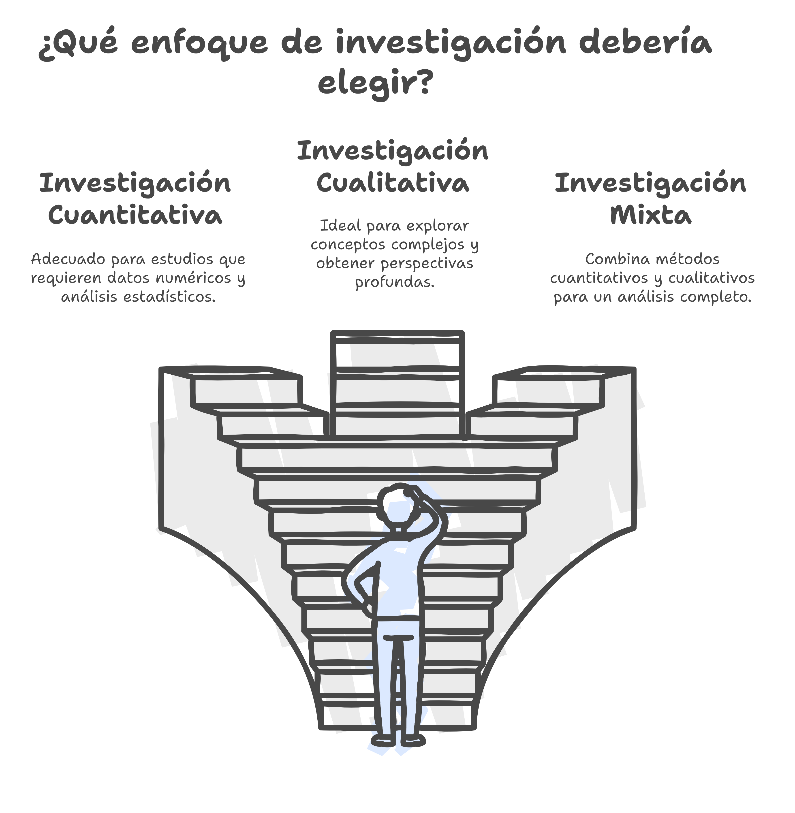

# ¿Qué es un Trabajo Fin de Máster?

## Introducción

El **Trabajo Fin de Máster (TFM)** es una pieza clave en la formación de posgrado. Su realización permite al estudiante demostrar su capacidad para llevar a cabo una investigación rigurosa, aplicar conocimientos adquiridos y desarrollar un pensamiento crítico dentro de su especialidad académica. Esta guía proporciona orientaciones esenciales para la elaboración de un TFM en el marco del Máster en Educación Digital..

## ¿Qué es un TFM?

:::{glossary}
Gradu Amaierako Lana
: **Master Amaierako Lana (TFM)** proiektu indibiduala, memoria edo ikerketa-azterketa originala da, eta masterreko ikasketetan eskuratutako ezagutzak, gaitasunak, trebetasunak eta gaitasunak biltzen eta garatzen ditu. Bere helburua ikasleak aukeratutako espezialitatearen eremu akademikoan ikerketa zorrotza, gogoetatsua eta autonomoa egiteko duen gaitasuna erakustea da. Ikerketa enpiriko batean edo dokumentu-iturrietan oinarritu behar da. Lana teorikoa izan daiteke soilik, baina enpirikoa izatea gomendatzen da, errealitatetik lortutako datuak edo informazioak erabiliz, dela dokumentu-iturri gisa (testuak, irudiak, web-orriak), dela datuak galdesorten, elkarrizketen, behaketa parte-hartzailearen eta abarren bidez biltzearen bidez.

:::

Un **TFM** es un estudio original que integra y desarrolla competencias adquiridas durante el máster. Puede adoptar diversas formas, como:

::::{grid} 1 1 2 3

:::{card}
:header: Investigación empírica o en fuentes documentales
- {term}`Investigación Cuantitativa`
- {term}`Investigación Cualitativa`
- {term}`Investigación Mixta`
:::

:::{card}
:header: Revisión de la literatura científica
- Sistemática
- Meta-análisis
:::

:::{card}
:header: Desarrollo y evaluación de propuestas educativas
- Metodológicas
- Tecnológicas
:::
::::

El TFM debe tener un enfoque académico, con un problema de investigación claro, un marco teórico bien fundamentado y una metodología adecuada para el análisis de datos.

:::{error} ¿Qué no es un TFM?
:name: notfm

- Un trabajo sin una definición clara del problema y objetivos de investigación.
- Una recopilación de información sin un análisis crítico.
- Un documento sin base teórica o metodológica.
- Un texto sin rigor académico o sin relación con el ámbito del máster.
:::

## Características de un TFM de calidad

Un TFM debe ser:

:::{tip} TFM de calidad
:name: tfmcalidad

- **Original y relevante**, con una contribución significativa al ámbito de estudio.
- **Metodológicamente sólido**, con una justificación clara de los enfoques utilizados.
- **Estructurado y coherente**, siguiendo un esquema lógico y una redacción académica.
- **Basado en fuentes fiables**, con referencias actualizadas y correctamente citadas.
:::

## Estructura Típica del TFM

El TFM tiene los siguientes apartados fundamentales ()

:::{list-table} Apartados del Trabajo Fin de Máster
:header-rows: 1
:label: tab:tfmapartabla

* - Sección
  - Descripción
  - \%Extensión
  - Palabras
* - PORTADA
  - Utilizar la plantilla del Máster
  -
  - 
* - RESUMEN
  - Síntesis informativa del TFM que ha de seguir la estructura «IMRD». Unas líneas dedicadas a la Introducción (justificación, relevancia y objetivo fundamental del TFM). Una descripción de la Metodología de investigación empleada. Los Resultados más importantes que se derivan de la investigacion. Y, por último, la principal Conclusión del estudio. Se deben incluir las de 3 a 5 palabras clave. También hay que realizar otro en Inglés. 
  - 
  - 200 250
* - AGRADECIMIENTOS
  - Opcional
  - 
  -
* - INTRODUCCIÓN
  - Presentación del trabajo: ideas-fuerza sobre las que se ha realizado el trabajo, finalidades perseguidas, descripción del contenido del trabajo.
  - 4%
  - 560 600
* - OBJETIVOS Y JUSTIFICACIÓN
  - Explicación de cuáles son las preguntas se quieren responder en la investigación y de los motivos que han conducido a la elección del tema. Hay que exponer la relevancia del objeto de estudio.
  - 6%
  - 840 900
* - MARCO TEÓRICO
  - El estado de la cuestión es el resultado de la consulta bibliográfica y el estudio de los expertos. En este apartado se espera encontrar un recorrido por enfoques y autores que se hacen preguntas similares a la de la investigación, que tratan temas relacionados y procuran resolver problemas compartidos. Es un espacio en el que, igualmente, se puede expresar argumentos a favor o en contra, y ser críticos con algunas teorías y autores.
  - 35%
  - 4900 5250
* - MÉTODO
  - Exposición de la unidad de análisis escogida y de las técnicas que se piensan utilizar para la recogida, la elaboración y el análisis de los datos y su adecuación al objeto de estudio y problema escogido. Hay que dedicar un espacio para reflexionar sobre las elecciones que se han tomado con relación a las técnicas de recogida y tratamiento de la información, y a la metodología de análisis e interpretación de los datos. Incluirá los diferentes pasos o fases de la investigación.
  - 10%
  - 1400 1500
* - RESULTADOS
  - Apartados o capítulos en los cuales se presenta el análisis de los datos obtenidos como fruto de la investigación.
  - 30%
  - 4200 4500
* - DISCUSIÓN Y CONCLUSIONES
  - Este es un apartado importante de la memoria de investigación, en donde se ha de explicar de una forma clara y sintética las aportaciones más importantes del trabajo. Las conclusiones no siempre tienen que ser cuestiones que la investigación ha solucionado, sino que a veces se trata de plantear nuevas preguntas o líneas de investigación que el proyecto podría desarrollar en el futuro.
  - 15%
  - 2100 2250
* - REFERENCIAS
  - La bibliografía de referencia irá listada alfabéticamente bajo el título de bibliografía. Tiene que contener la bibliografía y otras fuentes documentales que habéis utilizado para la investigación.
  - -
  - -
* - ANEXOS
  - Gráficos, datos originales, transcripciones y otros documentos que aporten aspectos significativos complementarios al texto de la memoria de investigación.
  - Optativo
  - -
:::

:::{mermaid}
:name: tfmmermaid

flowchart TD;
    Portada["Portada"];
    Resumen["Resumen"];
    Agradecimientos["Agradecimientos (Opcional)"];
    Índice["Índice"];
    Introducción["Introducción"];
    Objetivos["Objetivos y Justificación"];
    MarcoTeorico["Marco Teórico"];
    Método["Método"];
    Resultados["Resultados"];
    Discusión["Discusión y Conclusiones"];
    Referencias["Referencias"];
    Anexos["Anexos"];
    
    Portada --> Resumen;
    Resumen --> Agradecimientos;
    Agradecimientos --> Índice;
    Índice --> Introducción;
    Introducción --> Objetivos;
    Objetivos --> MarcoTeorico;
    MarcoTeorico --> Método;
    Método --> Resultados;
    Resultados --> Discusión;
    Discusión --> Referencias;
    Referencias --> Anexos;
:::

## Metodologías de Investigación Educativa

### Tradiciones y Corrientes de Investigación

El enfoque metodológico dependerá del tipo de investigación. Existen diversas metodologías, en base a diferentes **tradiciones de investigación** ({term}`Positivista`, {term}`Postpositivista`, {term}`Constructivista`, {term}`Transformador` y {term}`Pragmático`). 

De este planteamiento se derivan **3 grandes corrientes de investigación**: ()

:::{glossary}
Investigación Cuantitativa
: Adecuada  para estudios que requieren datos numéricos y análisis estadísticos. Las investigaciones cuantitativas buscan establecer relaciones de causa y efecto mediante el uso de datos numéricos y análisis estadísticos.

Investigación Cualitativa
: Ideal para explorar conceptos complejos y obtener perspectivas profundas. El énfasis se encuentra en la comprensión profunda de fenómenos sociales y humanos desde una perspectiva interpretativa.

Investigación Mixta
: La investigación mixta es un enfoque que **combina métodos cualitativos y cuantitativos en un mismo estudio** para obtener una comprensión más completa de un fenómeno. Se basa en la integración de datos numéricos y narrativos, permitiendo un análisis más profundo y una triangulación de resultados.Ejemplos en Educación Digital: \
**Enfoque Secuencial / Iterativo** \
Este enfoque **se desarrolla en fases ordenadas, donde los resultados de una etapa influyen en el diseño o implementación de la siguiente**. Dependiendo del propósito del estudio, puede ser **exploratorio (cualitativo → cuantitativo)** o e**xplicativo (cuantitativo → cualitativo)**. \
Ejemplo: Un estudio sobre el impacto de una plataforma de aprendizaje adaptativo en la motivación estudiantil.\
Fase 1 (Cualitativa): Se realizan entrevistas a docentes y estudiantes para identificar percepciones y desafíos del uso de la plataforma. \
Fase 2 (Cuantitativa): A partir de los hallazgos cualitativos, se diseña una encuesta para medir la motivación en una muestra más amplia. \
Fase 3 (Cualitativa): Se llevan a cabo grupos focales para interpretar los resultados cuantitativos y obtener una comprensión más profunda de las tendencias observadas. \
**Enfoque Concurrente / Simultáneo** \
Se implementan **los métodos cualitativos y cuantitativos al mismo tiempo, sin que una fase dependa de la otra**. Los datos se analizan por separado y luego se comparan para encontrar coincidencias, diferencias o relaciones complementarias. Permite obtener una visión más completa y reforzar la validez de los hallazgos. \
Ejemplo: Un estudio sobre la efectividad de la gamificación en cursos en línea. \
Se aplica una encuesta cuantitativa para medir la satisfacción y el compromiso de los estudiantes.\
Simultáneamente, se analizan foros de discusión y entrevistas para obtener una perspectiva cualitativa sobre la experiencia de los alumnos. \
Finalmente, los datos se comparan para identificar convergencias o divergencias entre los hallazgos cuantitativos y cualitativos. \
:::

:::{figure}
:label: fig:meto2

Elección del enfoque de investigación
:::

A su vez, estas corrientes se pueden subdividir en diferentes **diseños de investigación**:

::::{tab-set}

:::{tab-item} Investigación Cuantitativa
* No expermiental
* Pre-experimental
* Cuasi-experimental
* Experimental
:::

:::{tab-item} Investigación Cualitativa
* Estudio de Caso
* Investigación Narrativa
* Investigación Etnográfica
* Fenomenológica
* Grounded-Theory
* Investigación-Acción
* Investigación Basada en Diseño
:::

:::{tab-item} Investigación Mixta
* Investigación Cuantitativa + Investigación Cualitativa
::::

### Metodologías recomendadas por el Máster

::::{tab-set}

:::{tab-item} Investigación Cuantitativa
- **Investigación de análisis del funcionamiento de diferentes ámbitos de los sistemas educativos y las tecnologías digitales (TD)**: Estudios sobre el impacto de las tecnologías digitales en la educación, o investigaciones comparativas sobre modelos educativos apoyados en las TD.
:::

:::{tab-item} Investigación Cualitativa
- **Revisión Sistemática de la Literatura (RSL)**: Revisión bibliográfica sobre temáticas específicas de investigación en Tecnología Educativa o sobre determinadas fuentes especializadas en esta área.
:::

:::{tab-item} Investigación Mixta
- **Investigación aplicada**: Estudio de caso sobre la integración de las tecnologías digitales en la actividad educativa formal, no formal o informal.
::::

## Consejos prácticos para la elaboración del TFM

:::{tip} Consejos prácticos para la elaboración del TFM
:name: tfmconsejos

1. **Planificación:** Diseña un cronograma con tiempos estimados para cada fase.
2. **Elección del tema:** Opta por un tema que te motive y tenga relevancia académica.
3. **Revisión bibliográfica:** Utiliza fuentes fiables y actualizadas.
4. **Metodología adecuada:** Justifica la selección de métodos y herramientas.
5. **Redacción académica:** Evita subjetividades y utiliza un lenguaje formal y preciso.
6. **Revisión y corrección:** Solicita retroalimentación y revisa el texto antes de la entrega.
:::

## Recursos recomendados

- **Gestores bibliográficos:** Zotero, Mendeley, EndNote, RefWorks.
- **Software de análisis de datos:** SPSS, R, NVivo, ATLAS.ti.
- **Herramientas de escritura académica:** Markdown

## ¿Por dónde empezamos el TFM?

:::{pull-quote}
Para empezar el TFM debemos realizar un Proyecto de Trabajo de Fin Máster. 

