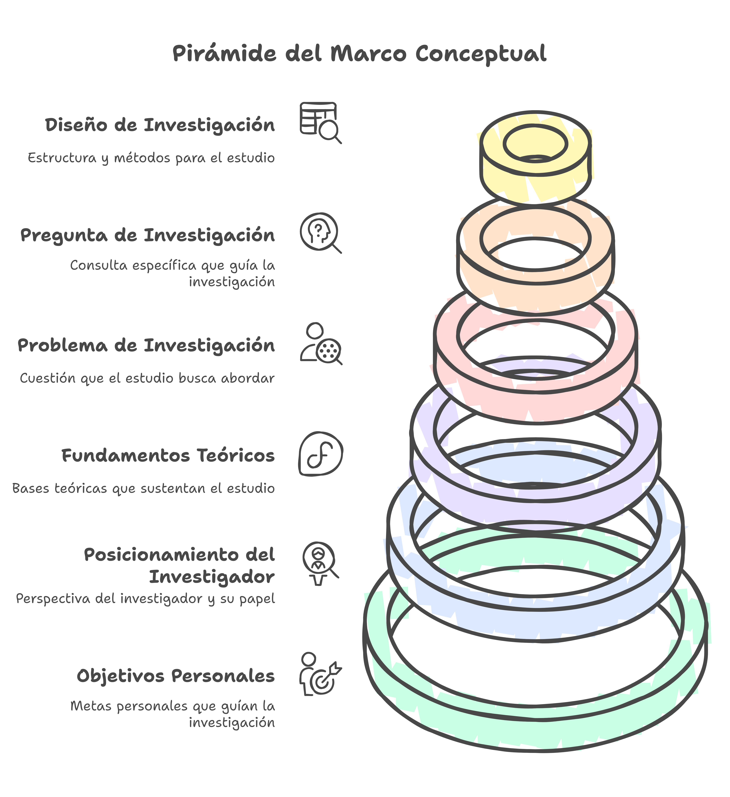

## ¿Cuál es núcleo fundamental de la investigación?

## ¿Cuáles son las 6 puntales del Marco Conceptual?

Durante estas tres semanas te vas a dedicar a desarrollar el **Marco Conceptual** de la investigación @marco, nucleo fundamental de cualquier estudio y **Situación de Aprendizaje** de esta asignatura. A lo largo de este curso es necesario que realices una serie de lecturas @lecturas que te servirán para realizar las tareas @actividades. Las tareas intermedias hay que entregalas en los foros del curso del campus virtual y las 2 tareas finales hay que subirlas como documentos ([info](#lugar)). Existe un [calendario de entrega sugerido](#aprox).

- @021objetivosp.md (05/01/2025) {term}`(+info) <Objetivos Personales>` 
- @022posicion.md (07/01/2025)  ({term}`Positivista`, {term}`Postpositivista`, {term}`Constructivista`, {term}`Transformador`  {term}`Pragmático`)
- @023bases.md (12/01/2025) {term}`(+info) <Fundamentos Teóricos>`  
- @024problema.md (14/01/2025) {term}`(+info) <Problema de Investigación>` 
- @025preguntas.md (18/01/2025) {term}`(+info) <Preguntas de Investigación>`
- @026diseno.md (20/01/2025) {term}`(+info) <Diseño de Investigación>` 

:::{figure}
:label: marco

Los 6 puntales del Marco Conceptual de una Investigación
:::

